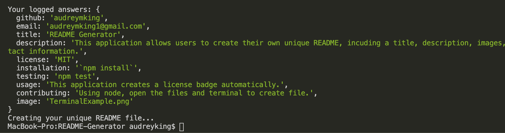

# Project Title

### README Generator


## Description

This application allows users to create their own unique README, incuding a title, description, images, instructions on use, testing, and further contact information.

## Table of Contents

* [Title](#title)
* [Description](#description)
* [Table of Contents](#table-of-contents)
* [Installation](#installation)
* [Usage](#usage)
* [Image](#images)
* [Contributing](#contributing)
* [Testing](#testing)
* [Contact](#contact)
* [Example](#example)


## Installation

To get started please run the following command:

```
`npm install`
```

## Usage

This application creates a license badge automatically.

## Image



Click on the link for a video for a full look on input and file presentation:
[README Video](https://drive.google.com/file/d/1-kY3KQzkeRT9DSj3wtW0d0bN-JokeJGX/view?usp=sharing)

## Contributing

To contribute please follow these directions:
Using node, open the files and terminal to create file.

## Testing

Run the following command to run application tests.

```
npm test
```

## Contact

My Email: audreymking1@gmail.com

GitHub: audreymking

Check out my projects at [audreymking](https://github.com/audreymking/).

## Example

Your README may look something like this:


